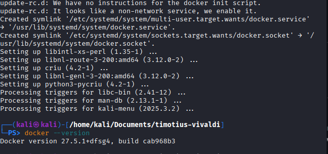
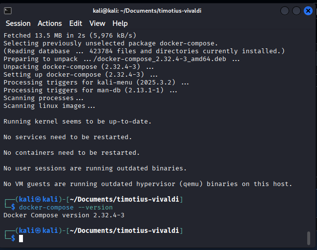
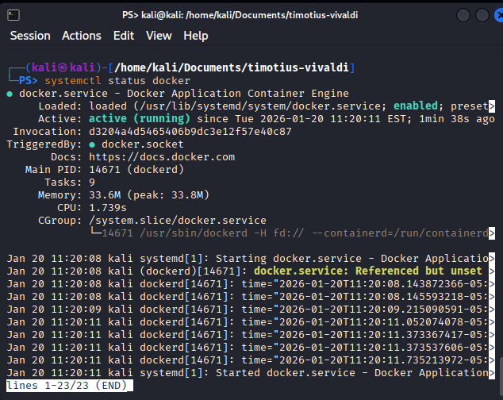
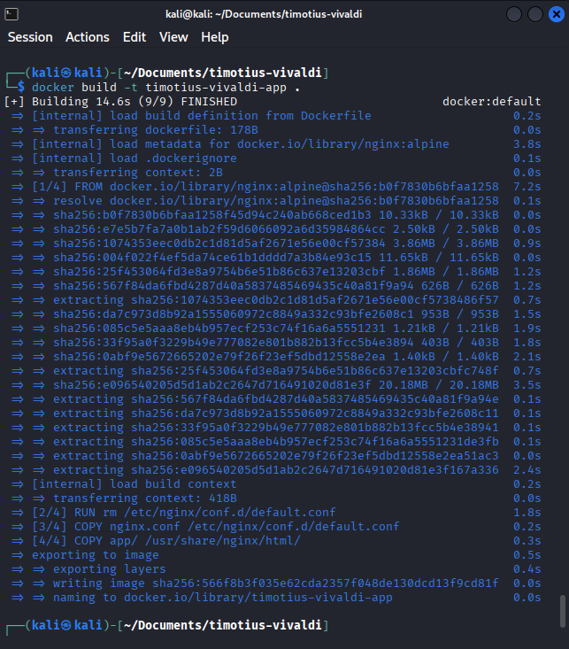
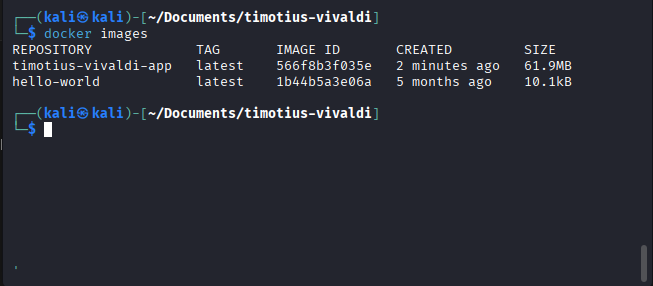
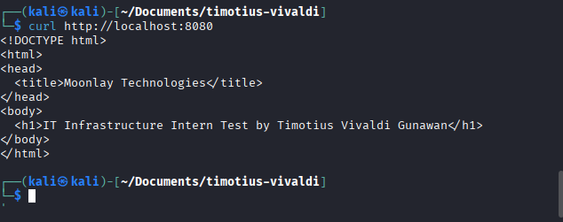
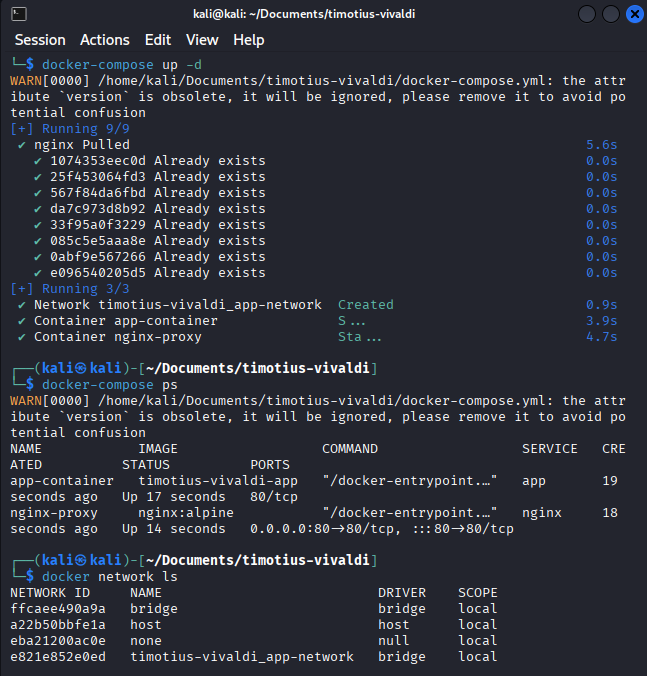

# IT Infrastructure Intern Assignment Submission

This repository contains the complete submission for the IT Infrastructure Intern, performed on a **Kali Linux VM** and versioned using **GitHub** and CI/CD pipeline using **Github Actions**.

The project demonstrates environment preparation, container-based deployment, Docker Compose orchestration, CI/CD concepts using GitHub Actions, and deployment safety practices.

Answers written by Timotius Vivaldi Gunawan

---

## Task 1 – Environment Preparation

Installed Docker and Docker Compose on Kali Linux VM, ensured Docker runs without sudo and starts automatically.

###  Deliverables

* Docker version
* Docker Compose version
* Docker service status

### Screenshots

**Docker Version**

**Docker Compose Version**

**Docker Service Status**

📄 Notes: See `install-notes.md`

---

## Task 2 – Container-Based Deployment

Deployed a simple Nginx static application using a custom Dockerfile. The application files are stored in the `app/` directory and copied into the container at build time.

### Deliverables

* Custom Dockerfile
* Local image build
* Running container with exposed port
* Application accessible via curl

### Screenshots

**Docker Build**

**Docker Images**

**Running Containers (docker ps)**

**Application Test (curl localhost)**

---

## Task 3 – Docker Compose

Used Docker Compose to orchestrate the application container and an Nginx reverse proxy, connected through a custom Docker bridge network.

### Deliverables

* `docker-compose.yml`
* Custom Docker network
* Successful compose startup

### Screenshots

**Docker Compose Network List**

---

## Task 4 – CI/CD Concept

Implemented a real **GitHub Actions** CI pipeline to automatically build the Docker image on each push to the `main` branch.

### Deliverables

* CI pipeline script
* CI/CD concept explanation

📄 Notes: See `cicd-notes.md`

---

## Task 5 – Deployment Safety

Outlined deployment safety best practices, production restrictions, and a simple rollback strategy.

📄 Notes: See `deployment-safety.md`

---
